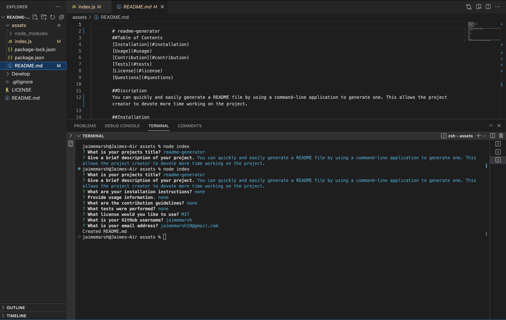

README-GENERATOR

 This project allows the user to easily generate a professional README file by using a command-line application to generate one. This allows the project creator to devote more time working on the project.

Install node.js onto your computer in the terminal & install inquirer in your code editor using "npm i inquirer @8.2.4"
After installation is complete and this repo is cloned, use "node index.js" and follow the prompts to complete the README.
Walkthrough Video:
https://drive.google.com/file/d/1xaZ6nWkjE44rn7yMoCZ4GDXzG2ZvMzX7/view?usp=sharing
 
 If you have any questions about the repo, open an issue or contact me directly at jaimemarsh19@gmail.com. You can find more of my work at my https://github.com/jaimemarsh